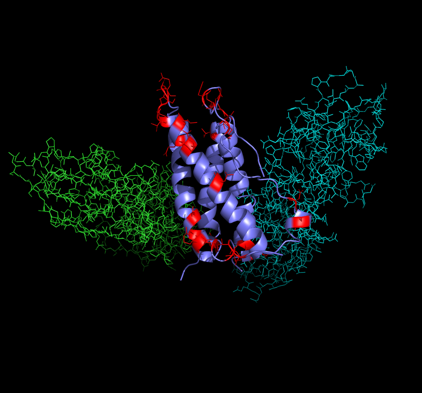

# 1cn4
Glycosylating erythropoetin

  

 "The Eagle"

Erythropoetin stimulates red blood cell production. It is used as a treatment for anemia. Potential glycosylation sites are shown in red. Predictions may be found in gly.out. This structure has three chains. It has erythropoetin bound to two copies of its receptors. Erythropoetin is chain C, so we only are interested in the predictions for chain C. We might like to see more predicted sites on the alpha helices. We might be able to arrange for this by modifying the solv_thresh variable in gly20.
